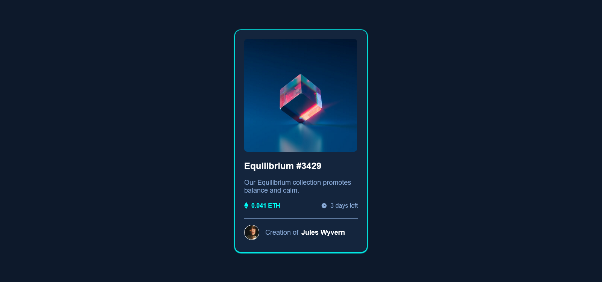
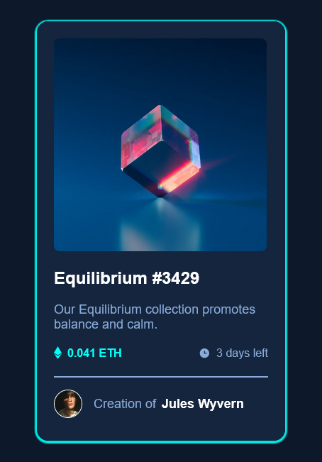

# CALCULUS001 - NFT preview card component solution

This is a solution to the NFT preview card component challenge

## Overview

### The challenge

Users should be able to:

- View the optimal layout depending on their device's screen size

### Screenshot

Desktop view of the challenge

Mobile view of the challenge

### Links

- Live Site URL: [Click to see the live challenge](calculusky001.netlify.app)

### Built with

- Semantic HTML5 markup
- CSS custom properties
- Flexbox
- Mobile-first workflow

### What I learned
I deepened my knowledge of media query.

## Acknowledgments

Thank you BLOCKCHAIN UNN et WEB3BRIDGE for the opportunity given to me to explore and build my skill
